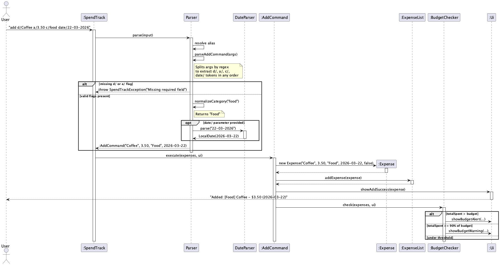
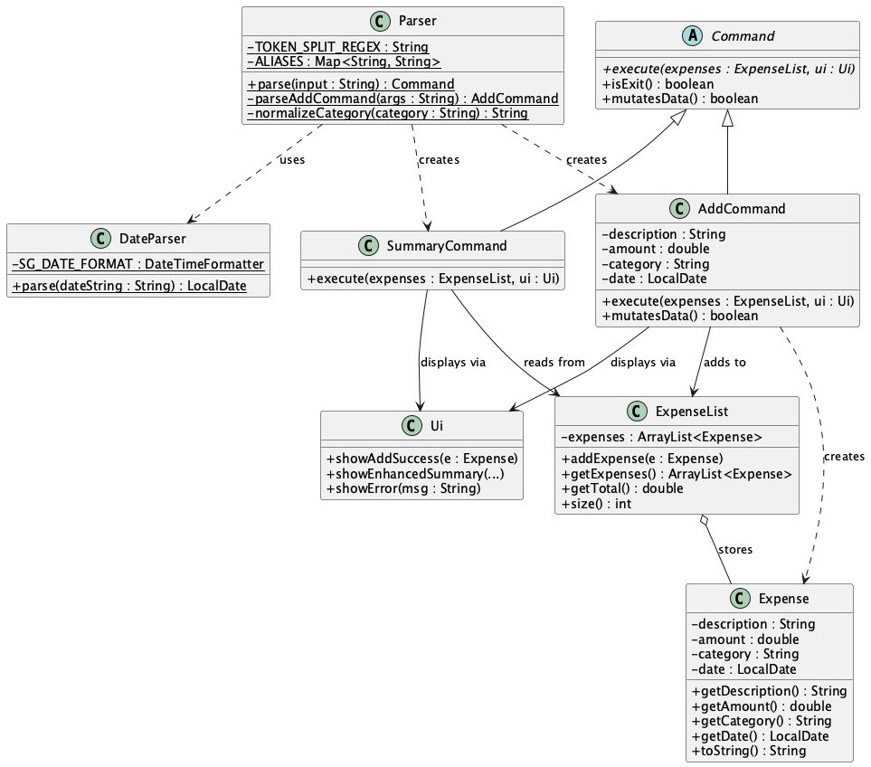
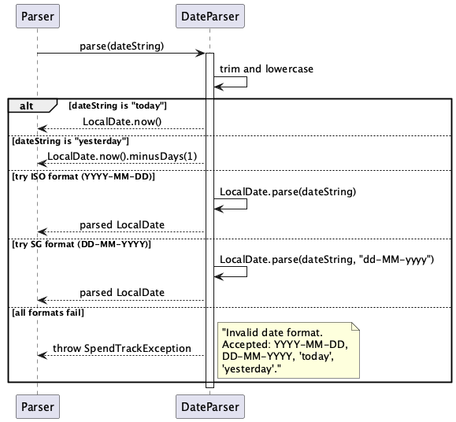
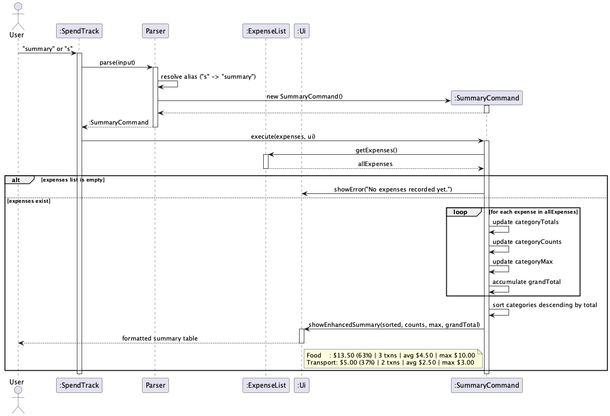
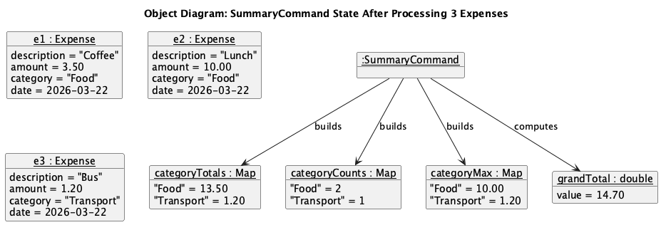
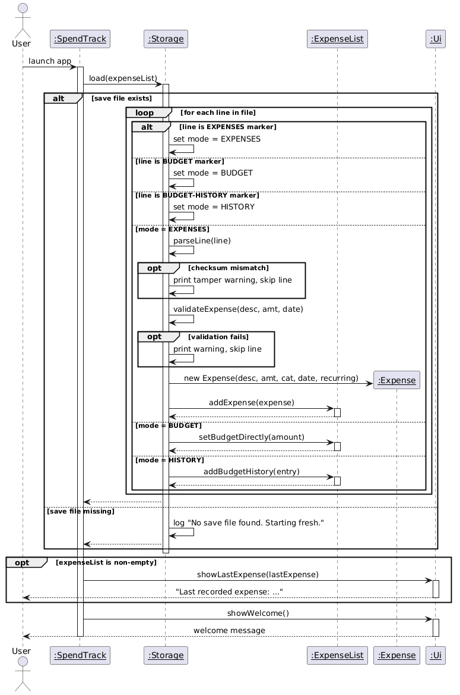
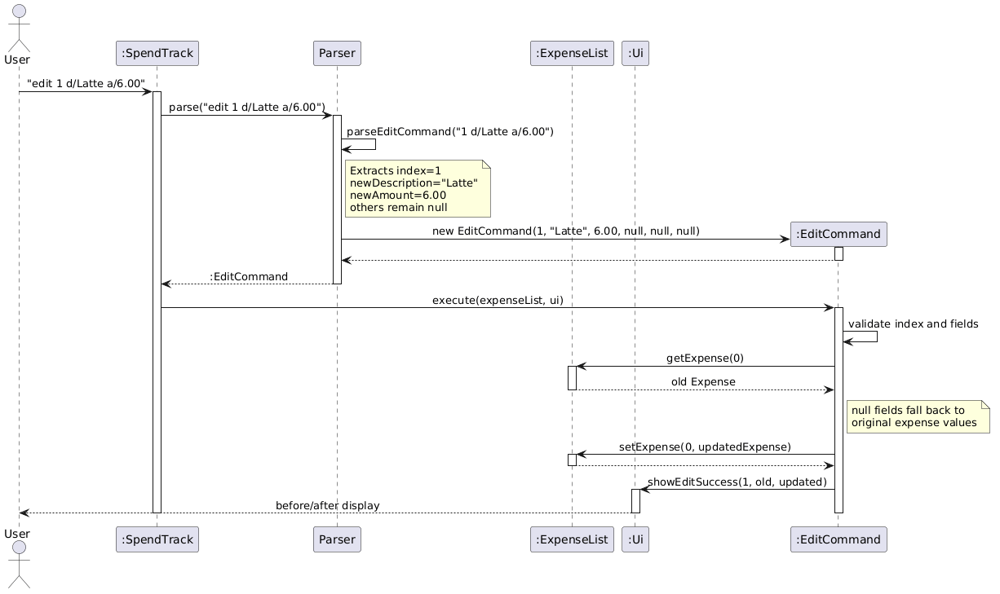

# Developer Guide

## Acknowledgements

No external libraries or reused code beyond the Java standard library.

## Design & Implementation

### Add Expense Feature

The add expense feature allows users to record a new expense with a description, amount, category, and optional date using the command:

```
add d/DESCRIPTION a/AMOUNT c/CATEGORY [date/DATE]
```

The `date/` parameter accepts multiple formats: `YYYY-MM-DD`, `DD-MM-YYYY`, `today`, or `yesterday`. If omitted, the expense is tagged with today's date. Categories are automatically normalised to title case (e.g., `food` becomes `Food`, `public transport` becomes `Public Transport`).

#### How it works

The add mechanism follows the Command pattern used throughout SpendTrack. The following steps describe how an add command is processed:

1. The user enters `add d/Coffee a/3.50 c/food date/22-03-2026`.
2. `SpendTrack.run()` passes the raw input to `Parser.parse()`.
3. `Parser.parse()` lowercases the command word and checks the `ALIASES` map (e.g., `a` resolves to `add`). It then delegates to `Parser.parseAddCommand()`.
4. `parseAddCommand()` uses a regex lookahead to split the arguments into tokens. Each token starts with a flag prefix (`d/`, `a/`, `c/`, `date/`, or `recurring/`), allowing the user to enter them in any order.
5. The `c/` value is passed through `normalizeCategory()`, which capitalises the first letter of each word.
6. The `date/` value is passed to `DateParser.parse()`, which tries multiple date formats in sequence (see [Flexible Date Parsing](#flexible-date-parsing-dateparser) below).
7. The extracted values are used to create a new `AddCommand` object.
8. `SpendTrack` calls `AddCommand.execute()`, which creates a new `Expense` and adds it to the `ExpenseList`.
9. `Ui.showAddSuccess()` displays a confirmation message to the user.

The following sequence diagram shows the full flow of the add command, including date parsing and category normalisation:



#### Design considerations

**Aspect: How to parse the flag-based input**

- **Alternative 1 (current):** Regex lookahead split.
    - Pros: Users can type flags in any order (`c/Food a/3.50 d/Coffee` also works). Handles descriptions with spaces naturally since the split only occurs before a flag prefix.
    - Cons: The regex is less readable than simple string splitting.

- **Alternative 2:** Split by space and manually iterate.
    - Pros: Simpler to understand.
    - Cons: Breaks if the description contains spaces (e.g., `d/Bus fare` would be split incorrectly).

Alternative 1 was chosen because supporting spaces in descriptions is essential for a natural user experience.

**Aspect: Where to validate input**

Validation is split across two layers:
- `Parser` validates the format (e.g., amount is a valid number, description is non-empty, date is a recognised format).
- `AddCommand` validates the values at runtime using assertions (e.g., amount is non-negative, parameters are not null).

This defence-in-depth approach ensures that even if one layer is bypassed during future refactoring, the other still catches invalid data.

**Aspect: Category normalisation**

- **Current approach:** `Parser.normalizeCategory()` capitalises the first letter of each word before creating the command.
    - Pros: Categories are consistent regardless of how the user types them. `food`, `FOOD`, and `fOoD` all become `Food`. This prevents duplicate categories in the summary.
    - Cons: Users cannot intentionally use unconventional casing (e.g., `WiFi`).

- **Alternative:** Normalise at display time only.
    - Pros: Preserves the user's original input.
    - Cons: `food` and `Food` would be treated as different categories in the summary, leading to fragmented breakdowns.

The current approach was chosen because consistent categories are more important for accurate spending analysis than preserving case.

#### Class structure

The following class diagram shows the relationships between the classes involved in the add and summary commands, including the v2.0 additions (`DateParser`, `SummaryCommand`, date field, alias map):



`Parser` resolves command aliases, creates `AddCommand` and `SummaryCommand` objects, and delegates date parsing to `DateParser`. `AddCommand` creates `Expense` objects and interacts with `ExpenseList` to store them. `SummaryCommand` reads from `ExpenseList` and displays grouped statistics via `Ui`. All concrete commands extend the abstract `Command` class.

### Flexible Date Parsing (DateParser)

The `DateParser` class provides flexible date input for the `add` command. It accepts four formats to accommodate different user preferences:

| Input | Interpretation |
|-------|---------------|
| `2026-03-22` | ISO format (YYYY-MM-DD) |
| `22-03-2026` | Singapore format (DD-MM-YYYY) |
| `today` | Current date (`LocalDate.now()`) |
| `yesterday` | Previous day (`LocalDate.now().minusDays(1)`) |

#### How it works

`DateParser.parse()` attempts each format in sequence, falling through to the next if parsing fails:

1. Trim the input and create a lowercased copy for keyword matching.
2. Check the lowercased copy for the keyword `today` — return `LocalDate.now()`.
3. Check the lowercased copy for the keyword `yesterday` — return `LocalDate.now().minusDays(1)`.
4. Try parsing the original trimmed string as ISO format (`YYYY-MM-DD`) using `LocalDate.parse()`. The original (not lowercased) string is used here because ISO date strings are case-sensitive.
5. If that fails, try parsing the original trimmed string as Singapore format (`DD-MM-YYYY`) using `DateTimeFormatter.ofPattern("dd-MM-yyyy")`.
6. If all formats fail, throw a `SpendTrackException` with a message listing the accepted formats.

The following sequence diagram shows the internal parsing flow:



#### Design considerations

**Aspect: How to support multiple date formats**

- **Current approach:** Sequential try-catch fallthrough in a single `parse()` method.
    - Pros: Simple to understand and extend. Adding a new format requires only one additional try-catch block. The keyword checks (`today`, `yesterday`) short-circuit before any format parsing.
    - Cons: Relies on exceptions for control flow, which is generally discouraged.

- **Alternative:** Use a regex to detect the format first, then parse with the correct formatter.
    - Pros: Avoids exception-based control flow.
    - Cons: More complex regex logic, and the regex must be kept in sync with the actual parsing logic.

The current approach was chosen for its simplicity and because `DateTimeParseException` is a lightweight unchecked exception that does not carry significant performance cost for a CLI application.

**Aspect: Extracting DateParser as a separate class**

`DateParser` was extracted from `Parser` to follow the Single Responsibility Principle (SRP). `Parser` is responsible for command routing and flag extraction, while `DateParser` handles date format resolution. This separation also allows other commands (e.g., `filter`, `edit`) to reuse `DateParser` without duplicating parsing logic.

### Category Summary Feature

The category summary feature displays a spending breakdown grouped by category, showing totals, percentages, transaction counts, averages, and maximum amounts per category:

```
summary
```

The `summary` command can also be invoked using the alias `s`.

#### How it works

1. The user enters `summary` (or `s`).
2. `Parser.parse()` resolves the alias and creates a `SummaryCommand`.
3. `SummaryCommand.execute()` retrieves all expenses from `ExpenseList`.
4. If the list is empty, an error message is shown and the command returns.
5. For each expense, three `LinkedHashMap` structures are updated:
    - `categoryTotals` — running sum per category.
    - `categoryCounts` — transaction count per category.
    - `categoryMax` — largest single expense per category.
6. The grand total is computed alongside the per-category totals.
7. Categories are sorted in descending order by total amount.
8. `Ui.showEnhancedSummary()` displays the formatted table with percentage, count, average, and max for each category.

The following sequence diagram shows the summary command execution flow:



#### Object diagram: summary state after processing

The following object diagram shows a snapshot of the internal state of `SummaryCommand` after processing three expenses (Coffee $3.50, Lunch $10.00 in Food; Bus $1.20 in Transport):



The three maps (`categoryTotals`, `categoryCounts`, `categoryMax`) are built in a single pass over the expense list. The `grandTotal` is computed in the same loop. After sorting, the maps are passed to `Ui.showEnhancedSummary()` which computes the average and percentage for display.

#### Design considerations

**Aspect: Data structure for category grouping**

- **Current approach:** Three separate `LinkedHashMap` instances (totals, counts, max).
    - Pros: Simple and flat. Each map is independently readable and testable. The single-pass loop updates all three maps simultaneously.
    - Cons: Three maps must be kept in sync (all keyed by category name).

- **Alternative:** A custom `CategoryStats` class holding total, count, and max fields.
    - Pros: Encapsulates all statistics for a category in one object. Eliminates the risk of map key mismatches.
    - Cons: Introduces an additional class for a relatively simple computation. Over-engineering for the current scope.

The current approach was chosen because three maps are straightforward for the current feature scope. If more statistics are added in the future, refactoring to a `CategoryStats` class would be a natural next step.

**Aspect: Sorting order**

Categories are sorted in descending order by total spending, so the highest-spend category appears first. This matches the user's primary concern: identifying where they are overspending. The sort uses `Double.compare(b, a)` (reversed) to achieve descending order.

### Command Aliases

To support faster input for experienced users, single-letter aliases are defined for common commands:

| Alias | Full command |
|-------|-------------|
| `a` | `add` |
| `d` | `delete` |
| `l` | `list` |
| `s` | `summary` |
| `b` | `budget` |
| `h` | `help` |

#### How it works

Alias resolution occurs in `Parser.parse()` before the main command switch:

1. The input is split into command word and arguments.
2. The command word is lowercased (so `A`, `a`, and `Add` all work).
3. The `ALIASES` map is checked using `getOrDefault()`. If the command word is a known alias, it is replaced with the full command name.
4. The resolved command word proceeds through the normal switch-case routing.

The alias map is defined as a static `HashMap<String, String>` initialised in a static block, making it easy to add new aliases as new commands are introduced.

### Storage Feature

The storage feature allows SpendTrack to persist expense data and budget across sessions. Expenses are saved to `data/spendtrack.txt` automatically after every mutating command (`add`, `delete`, `edit`), and loaded back on startup.

#### How it works

**Saving:**

1. After every mutating command executes, `SpendTrack` calls `Storage.save(expenseList)`.
2. `Storage` opens `data/spendtrack.txt` using a `try-with-resources` block with a `FileWriter`.
3. Each expense is written as a pipe-delimited line: `DESCRIPTION|AMOUNT|CATEGORY|DATE|RECURRING`.
4. The budget is written at the end after a `---BUDGET---` separator line.
5. If the `data/` directory does not exist, it is created automatically before writing.
6. Any write failure prints a warning — the app does not crash.

**Loading:**

1. On startup, `SpendTrack` calls `Storage.load(expenseList)` before the main command loop.
2. `Storage` reads `data/spendtrack.txt` line by line using a `BufferedReader`.
3. Lines above `---BUDGET---` are parsed into `Expense` objects and added to the `ExpenseList`.
4. The line below `---BUDGET---` is parsed as the saved budget amount.
5. Malformed lines are skipped with a warning message.
6. If the file does not exist, the app starts silently with an empty list.

The following sequence diagram shows the startup load flow:



#### File format

```
DESCRIPTION|AMOUNT|CATEGORY|DATE|RECURRING
Coffee|3.50|Food|2026-03-22|false
Bus fare|1.80|Transport|2026-03-22|false
---BUDGET---
500.00
```

#### Design considerations

**Aspect: Where to trigger saves**

- **Current approach:** Every mutating command calls `Storage.save()` after executing.
    - Pros: Data is never lost even if the app crashes mid-session.
    - Cons: Slightly more I/O per command, but negligible for typical expense list sizes.

- **Alternative:** Save only on `bye` command.
    - Pros: Fewer writes.
    - Cons: Data loss if the app is closed unexpectedly.

**Aspect: File format**

- Pipe (`|`) delimiter was chosen over CSV because expense descriptions may contain commas.
- All file I/O is encapsulated inside `Storage` — no `FileWriter` or `BufferedReader` exists in command classes, keeping the separation of concerns clean.

### Edit Expense Feature

The edit expense feature allows users to update one or more fields of an existing expense by its 1-based index:
```
edit INDEX [d/DESCRIPTION] [a/AMOUNT] [c/CATEGORY] [date/YYYY-MM-DD]
```

Only the fields provided are updated — all other fields remain unchanged.

#### How it works

1. The user enters `edit 1 d/Latte a/6.00`.
2. `SpendTrack.run()` passes the input to `Parser.parse()`.
3. `Parser.parse()` identifies the command word `edit` and delegates to `Parser.parseEditCommand()`.
4. `parseEditCommand()` extracts the index from the first token, then splits the remaining arguments using the same flag regex as `parseAddCommand()` to extract only the fields provided. Fields not provided are left as `null`.
5. A new `EditCommand` is created with the index and the parsed fields (`null` for unchanged fields).
6. `EditCommand.execute()` validates the index and fields, retrieves the existing `Expense` from `ExpenseList`, constructs an updated `Expense` by substituting `null` fields with the original expense's values, and replaces it via `ExpenseList.setExpense()`.
7. `Ui.showEditSuccess()` displays the before and after state of the expense.

The following sequence diagram illustrates the full flow of the edit command:



#### Design considerations

**Aspect: How to handle partial updates**

- **Current approach:** Fields not provided by the user are passed as `null`. Inside `EditCommand.execute()`, `null` fields fall back to the original expense's values.
  - Pros: Clean separation — `Parser` handles input extraction, `EditCommand` handles the update logic. The command is immutable once constructed.
  - Cons: Using `null` as a sentinel requires null checks throughout `execute()`.

- **Alternative:** Pass the original `Expense` into the command and only override provided fields.
  - Pros: No null checks needed inside the command.
  - Cons: Tighter coupling between `Parser` and `ExpenseList`, since the parser would need to look up the existing expense at parse time rather than at execution time.

The current approach was chosen to keep `Parser` stateless and decoupled from `ExpenseList`.


## Product scope

### Target user profile

NUS students who want a fast, keyboard-driven way to track daily spending. The target user prefers typing commands over clicking through a GUI, is comfortable with a CLI, and wants to quickly log expenses on the go.

### Value proposition

SpendTrack helps students track expenses faster than a typical GUI app. Users can add, delete, list, and analyse expenses with short typed commands. Budget tracking and spending summaries help students stay within their means.

## User Stories

| Version | As a ... | I want to ... | So that I can ... |
|---------|----------|---------------|-------------------|
| v1.0 | new user | see usage instructions | refer to them when I forget how to use the application |
| v1.0 | student | add an expense with description, amount, and category | keep track of my spending |
| v1.0 | student | delete an expense by index | remove entries I added by mistake |
| v1.0 | student | list all my expenses | see everything I have spent |
| v1.0 | student | view the total of all expenses | know how much I have spent overall |
| v1.0 | student | set a monthly budget | control my spending |
| v1.0 | student | view my remaining balance | know how much I can still spend |
| v2.0 | student | tag expenses with a date | log past purchases I forgot to record |
| v2.0 | student | enter dates in DD-MM-YYYY or use "today"/"yesterday" | log expenses quickly without remembering ISO format |
| v2.0 | student | view a category breakdown with statistics | see where I am overspending and by how much |
| v2.0 | fast typist | use short aliases for commands | log expenses quickly without typing full command names |
| v2.0 | student | have categories auto-normalised | avoid duplicate categories due to inconsistent casing |
| v2.0 | student | search expenses by keyword | find a specific purchase quickly |
| v2.0 | student | save and load expenses from file | keep my data between sessions |
| v2.0 | student | filter expenses by date range | analyse spending over specific periods |
| v2.0 | student | view full details of a single expense by index | inspect it without scrolling the entire list |
| v2.0 | forgetful user | see my last logged expense on startup | avoid logging duplicate entries |

## Non-Functional Requirements

1. Should work on any mainstream OS (Windows, macOS, Linux) with Java 17 installed.
2. Should respond to any command within 1 second.
3. A user with average typing speed should be able to log an expense faster than using a GUI app.
4. Data files should be human-readable plain text.

## Glossary

* *Expense* - A single spending entry with a description, amount, category, and date.
* *Budget* - A monthly spending limit set by the user.
* *Remaining balance* - The difference between the budget and total expenses.
* *Mutating command* - A command that changes the expense list (add, delete, edit).
* *Category normalisation* - Automatic capitalisation of the first letter of each word in a category name (e.g., `public transport` becomes `Public Transport`).
* *Alias* - A single-letter shortcut for a command (e.g., `a` for `add`, `s` for `summary`).
* *DateParser* - A utility class that parses date strings in multiple formats (ISO, Singapore, keywords).

## Instructions for manual testing

### Launch

1. Ensure Java 17 is installed.
2. Download the latest `spendtrack.jar` from the GitHub releases page.
3. Open a terminal, navigate to the folder containing the JAR, and run: `java -jar spendtrack.jar`

### Adding an expense

1. Type `add d/Coffee a/3.50 c/Food` and press Enter.
2. Expected: confirmation message showing the added expense with today's date and category `Food`.
3. Type `add d/Lunch a/12.00 c/food date/22-03-2026` to test DD-MM-YYYY format and category normalisation.
4. Expected: date shown as `2026-03-22`, category shown as `Food` (capitalised).
5. Type `add d/Snack a/2.00 c/Food date/yesterday` to test keyword date input.
6. Expected: date shown as yesterday's date.
7. Type `add d/Fail a/3.00 c/Food date/` to test empty date.
8. Expected: error message listing accepted date formats.
9. Type `a d/Tea a/1.50 c/Food` to test the `a` alias.
10. Expected: same behaviour as `add`.

### Category summary

1. Add several expenses across different categories.
2. Type `summary` (or `s`) and press Enter.
3. Expected: categories listed in descending order by total, with percentage, transaction count, average, and max per category.
4. Type `summary` with no expenses in the list.
5. Expected: error message `No expenses recorded yet.`

### Deleting an expense

1. Type `list` to see current expenses and their indices.
2. Type `delete 1` to remove the first expense.
3. Expected: confirmation showing the deleted expense.
4. Type `delete 999` to test out-of-range index.
5. Expected: error message showing the valid range.

### Save and load

1. Add a few expenses and set a budget.
2. Type `bye` to exit.
3. Relaunch the app: `java -jar spendtrack.jar`
4. Expected: all expenses and budget restored. Last expense shown as a reminder on startup.
5. Open `data/spendtrack.txt` to verify the file format.

### Filtering by date range

1. Add expenses with explicit dates: `add d/Coffee a/3.50 c/Food date/2026-03-01`
2. Type `filter from/2026-03-01 to/2026-03-31`
3. Expected: only expenses within that range shown.
4. Type `filter from/2026-03-31 to/2026-03-01`
5. Expected: error message — start date must be before end date.

### Finding an expense by index

1. Type `list` to see current expenses.
2. Type `find 1` to view details of the first expense.
3. Expected: detailed view with all fields.
4. Type `find 999`
5. Expected: out-of-range error message.

### Setting a budget

1. Type `budget 500` to set a $500 budget.
2. Expected: confirmation showing budget, current total, and remaining.
3. Type `remaining` to verify the remaining balance.
4. Type `budget -10` to test negative amount.
5. Expected: error message.
